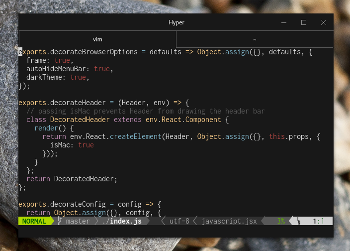

# hyper-native-window-decoration


Native window decorations in HyperTerm.

**Important:** Designed for Hyper 2.x.

---

## Install

Edit your `~/.hyper.js`:

```
plugins: [
  'hyper-native-window-decoration',
],
```

## Why?

Hyper uses it's own client-side decorations, and unless you're on a Mac, these
decorations don't fit in well with the rest of the desktop environment. Using 
the platform's native window decorations is an easy way to make the terminal 
blend in.

Here's that same screenshot, without this plugin:


