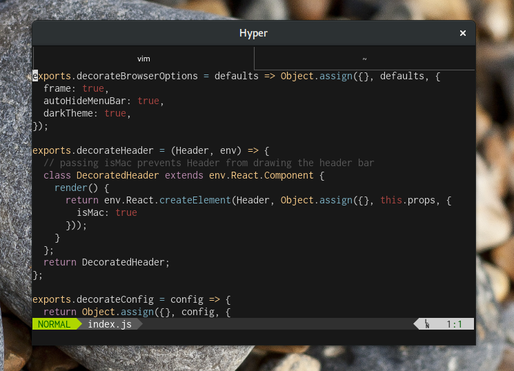

# hyper-native-window-decoration
> ✅ this repo fix error of 'getCurrentWindow'



Native window decorations in HyperTerm.

**Important:** Designed for Hyper 2.x.

---

## Why?

Hyper uses it's own client-side decorations, and unless you're on a Mac, these
decorations don't fit in well with the rest of the desktop environment. Using
the platform's native window decorations is an easy way to make the terminal
blend in.

Here's that same screenshot, without this plugin:


## Install
Clone this repo in <code>~/.hyper_plugins/local</code>
```
git clone https://github.com/gabrielmelogm/hyper-native-window-decoration.git ~/.hyper_plugins/local
```


Edit your `~/.hyper.js`:

```
plugins: [...],
localPlugins: ["hyper-native-window-decoration"]
```

## Configuration

You can add configuration options to your `.hyper.js` configuration file:

```
module.exports = {
  ...
  config: {
    ...
    nativeWindowDecoration: {
      menuBar: 'hide',
    },
    ...
  },
  ...
};
```

### `menuBar` (optional, string)

By default, this plugin will auto-hide the menu bar. You can toggle visibility
using the alt key.

If you'd like to change this behavior, you can set `menuBar` to:

- `show`: Always show the menu bar.
- `disable`: Never show the menu bar, even if `alt` is pressed. Keyboard
  shortcuts and the right-click context menu will still work.
- `hide`: The default behavior. Hide the menu bar unless `alt` is pressed.
